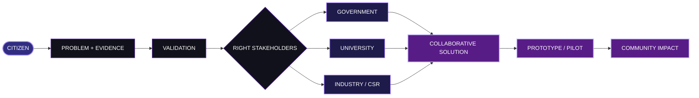

<div align="center">

<br>


<br>


<br><br>

<a href="https://setu-connect.vercel.app/">

</a>

<br><br>


</div>

---

<div align="center">

# **A problem should have a path forward.**

### SETU is a civic innovation platform that connects **citizens, government, universities and industry** so that local problems can move beyond reporting and toward validated, collaborative solutions.

</div>

<br>

---

# WHY SETU EXISTS

A citizen can identify a real problem.

A department can receive it.

A university may have the expertise.

An industry or CSR partner may have the resources.

But when those stakeholders remain disconnected, the problem can remain stuck between them.

**SETU is designed to become the bridge.**

Not another isolated complaint box.

Not another disconnected dashboard.

A system that connects the **problem, the evidence, the people and the institutions capable of acting on it.**

---

<div align="center">

# THE SETU LOOP

<br>


<br><br>



</div>

---

# THE BRIDGE

<div align="center">

<table>
<tr>

<td align="center" width="20%">

### CITIZEN

<sub>
Finds the problem
</sub>

</td>

<td align="center">→</td>

<td align="center" width="20%">

### GOVERNMENT

<sub>
Handles the public issue
</sub>

</td>

<td align="center">+</td>

<td align="center" width="20%">

### UNIVERSITY

<sub>
Brings knowledge
</sub>

</td>

<td align="center">+</td>

<td align="center" width="20%">

### INDUSTRY

<sub>
Brings resources
</sub>

</td>

<td align="center">→</td>

<td align="center" width="20%">

### IMPACT

<sub>
Returns to the community
</sub>

</td>

</tr>
</table>

</div>

<br>

SETU's core idea is simple:

> **The person who identifies the problem does not have to be the person who solves it.**

The platform exists to help connect that problem to the stakeholder who can move it forward.

---

# FROM A LOCAL PROBLEM TO A COLLABORATIVE SOLUTION

### A citizen submits an issue.

Descriptions, location information and supporting evidence help establish the context around the problem.

### The community adds visibility.

Common issues can be discovered and supported by other citizens, allowing shared concerns to become visible.

### Government receives the operational responsibility.

Relevant departments get access to the complaints associated with their area of responsibility.

### Universities can contribute expertise.

Research, technical knowledge and academic recommendations can enter the solution process.

### Industry and CSR can contribute resources.

Implementation support, materials, funding or practical expertise can become part of the response.

### The outcome comes back to the community.

SETU is designed around a continuous loop:

**Problem → Collaboration → Solution → Community Impact**

---

<div align="center">

# **ONE PROBLEM.**

# **MANY POSSIBLE CONTRIBUTORS.**

<br>


</div>

---

# WHAT EACH SIDE SEES

<table>
<tr>

<td width="25%" valign="top">

### CITIZEN

**REPORT**

Submit issues with descriptions, location details and evidence.

**DISCOVER**

Find common issues around the community.

**SUPPORT**

Upvote issues that affect the wider community.

**TRACK**

Follow submitted complaint progress.

</td>

<td width="25%" valign="top">

### GOVERNMENT

**RECEIVE**

Access complaints relevant to the assigned department.

**PRIORITIZE**

Work with urgency and severity information.

**MANAGE**

Move complaints through an operational lifecycle.

**RESOLVE**

Complete the resolution workflow with verification.

</td>

<td width="25%" valign="top">

### UNIVERSITY

**RESEARCH**

Study real community challenges.

**ADVISE**

Provide technical and academic recommendations.

**COLLABORATE**

Connect expertise to real problems.

</td>

<td width="25%" valign="top">

### INDUSTRY / CSR

**SUPPORT**

Identify problems where resources can help.

**CONTRIBUTE**

Provide implementation support and practical expertise.

**PARTNER**

Work alongside institutions toward deployment.

</td>

</tr>
</table>

---

<div align="center">

# **SETU DOESN'T END AT “SUBMITTED”.**

<br>

```text id="y6we0y"
             PROBLEM
                │
                ▼
             EVIDENCE
                │
                ▼
            VALIDATION
                │
                ▼
        ┌───────┼────────┐
        ▼       ▼        ▼
    GOVERNMENT  UNIVERSITY  INDUSTRY
        │       │        │
        └───────┼────────┘
                ▼
           COLLABORATION
                │
                ▼
        PROTOTYPE / PILOT
                │
                ▼
          REAL-WORLD IMPACT
```

</div>

---

# THE PRODUCT LAYERS

<div align="center">

### **CITIZEN LAYER**

Report · Discover · Support · Track

<br>

### **GOVERNANCE LAYER**

Categorize · Prioritize · Manage · Resolve

<br>

### **KNOWLEDGE LAYER**

Research · Expertise · Recommendations

<br>

### **RESOURCE LAYER**

Industry · CSR · Implementation Support

<br>

### **IMPACT LAYER**

Progress · Outcomes · Community Feedback

</div>

---

# BUILT TO CONNECT

<div align="center">


<br><br>

`React` · `Vite` · `Node.js` · `Express` · `Python` · `PostgreSQL` · `PostGIS`

<br><br>


</div>

---

<div align="center">

# THE EXPERIENCE

<br>

### **A citizen sees the problem.**

### **SETU finds the bridge.**

<br>

<a href="https://setu-connect.vercel.app/">


</a>

<br><br>

<sub>Live platform · setu-connect.vercel.app</sub>

</div>

---

<div align="center">

# BUILT FOR A DIFFERENT KIND OF CIVIC PLATFORM

<br>

<table>
<tr>

<td align="center" width="25%">

### REPORT

<sub>
A problem enters the system.
</sub>

</td>

<td align="center" width="25%">

### CONNECT

<sub>
The right stakeholders enter the loop.
</sub>

</td>

<td align="center" width="25%">

### COLLABORATE

<sub>
Knowledge and resources come together.
</sub>

</td>

<td align="center" width="25%">

### IMPACT

<sub>
The solution returns to the people.
</sub>

</td>

</tr>
</table>

</div>

---

# THE PEOPLE BEHIND SETU

<div align="center">

### **Five contributors. One bridge.**

<br>

<table>
<tr>

<td align="center" width="20%">

<a href="https://github.com/nithixh">

<strong>NITHIXH</strong>

</a>

<br><br>

<a href="../../commits?author=nithixh">

<sub>view commits ↗</sub>

</a>

</td>

<td align="center" width="20%">

<a href="https://github.com/LoganathRK">

<strong>LOGANATH RK</strong>

</a>

<br><br>

<a href="../../commits?author=LoganathRK">

<sub>view commits ↗</sub>

</a>

</td>

<td align="center" width="20%">

<a href="https://github.com/vishalisaravanan127">

<strong>VISHALI SARAVANAN</strong>

</a>

<br><br>

<a href="../../commits?author=vishalisaravanan127">

<sub>view commits ↗</sub>

</a>

</td>

<td align="center" width="20%">

<a href="https://github.com/NITHISH-2207">

<strong>NITHISH</strong>

</a>

<br><br>

<a href="../../commits?author=NITHISH-2207">

<sub>view commits ↗</sub>

</a>

</td>

<td align="center" width="20%">

<a href="https://github.com/nirmal-kumar-v">

<strong>NIRMAL KUMAR V</strong>

</a>

<br><br>

<a href="../../commits?author=nirmal-kumar-v">

<sub>view commits ↗</sub>

</a>

</td>

</tr>
</table>

<br>

<sub>

The commit links above are relative GitHub links, so they automatically open this repository's contributor-specific commit history.

</sub>

</div>

---

<div align="center">

# SETU

<br>


<br><br>

### **Citizens → Institutions → Collaboration → Impact**

<br>

<sub>SETU · Societal Engagement & Technology Utility</sub>

</div>

<br>


