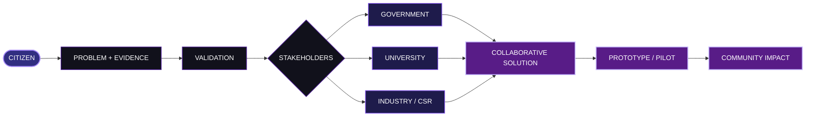

<div align="center">

<br>


<br>


<br><br>

<a href="https://setu-connect.vercel.app/">

</a>

<br><br>


</div>

---

<div align="center">

# **A problem should have a path forward.**

### SETU is a civic innovation platform that connects **citizens, government, universities and industry** so that local problems can move beyond reporting and toward validated, collaborative solutions.

</div>

<br>

---

# WHY SETU EXISTS

A citizen can identify a real problem.

A government department may be responsible for it.

A university may have the expertise to understand it.

An industry or CSR partner may have the resources to help implement a solution.

But when these stakeholders remain disconnected, the problem can stay stuck between them.

**SETU is designed to become the bridge.**

Not another isolated complaint box.

Not another disconnected dashboard.

A platform that connects the **problem, the evidence, the people and the institutions capable of moving it forward.**

---

<div align="center">

# THE SETU JOURNEY

<br>


<br><br>



</div>

---

# THE BRIDGE

<div align="center">

<table>
<tr>

<td align="center" width="20%">

### CITIZEN

<sub>Finds the problem</sub>

</td>

<td align="center">→</td>

<td align="center" width="20%">

### GOVERNMENT

<sub>Handles the public issue</sub>

</td>

<td align="center">+</td>

<td align="center" width="20%">

### UNIVERSITY

<sub>Brings knowledge</sub>

</td>

<td align="center">+</td>

<td align="center" width="20%">

### INDUSTRY

<sub>Brings resources</sub>

</td>

<td align="center">→</td>

<td align="center" width="20%">

### IMPACT

<sub>Returns to the community</sub>

</td>

</tr>
</table>

</div>

<br>

SETU is built around a simple idea:

> **The person who identifies the problem does not have to be the person who solves it.**

The platform helps connect that problem to the stakeholder who can contribute to the solution.

---

# FROM PROBLEM TO POSSIBILITY

### A citizen identifies an issue

Descriptions, location information and supporting evidence help establish the context around the problem.

### The community adds visibility

Citizens can discover common issues and support them, making shared concerns easier to recognize.

### Government receives operational responsibility

Relevant departments receive access to complaints associated with their assigned category.

### Universities contribute expertise

Research, technical knowledge and academic recommendations can become part of the solution process.

### Industry and CSR contribute resources

Funding, materials, practical expertise or implementation support can be brought into the ecosystem.

### The outcome reaches the community

The goal is to move beyond a submitted complaint toward a **validated, collaborative and measurable response**.

---

<div align="center">

# **ONE PROBLEM.**

# **MANY POSSIBLE CONTRIBUTORS.**

<br>


</div>

---

# WHAT EACH STAKEHOLDER GETS

<table>
<tr>

<td width="25%" valign="top">

### CITIZEN

**REPORT**

Submit issues with descriptions, locations and evidence.

**DISCOVER**

Explore common problems reported by others.

**SUPPORT**

Upvote issues affecting the wider community.

**TRACK**

Follow personally submitted complaints.

</td>

<td width="25%" valign="top">

### GOVERNMENT

**RECEIVE**

Access complaints relevant to the department.

**PRIORITIZE**

Use urgency and severity to organize response.

**MANAGE**

Move complaints through an operational lifecycle.

**RESOLVE**

Complete the resolution process with verification.

</td>

<td width="25%" valign="top">

### UNIVERSITY

**RESEARCH**

Study real-world community challenges.

**ADVISE**

Provide academic and technical recommendations.

**COLLABORATE**

Connect expertise with problems that need it.

</td>

<td width="25%" valign="top">

### INDUSTRY / CSR

**IDENTIFY**

Discover areas where support may be useful.

**CONTRIBUTE**

Provide resources, expertise or implementation support.

**PARTNER**

Work alongside institutions toward deployment.

</td>

</tr>
</table>

---

<div align="center">

# **SETU DOESN'T END AT “SUBMITTED”.**

<br>

```text
                        PROBLEM
                           │
                           ▼
                        EVIDENCE
                           │
                           ▼
                       VALIDATION
                           │
                ┌──────────┼──────────┐
                ▼          ▼          ▼
          GOVERNMENT   UNIVERSITY   INDUSTRY
                │          │          │
                └──────────┼──────────┘
                           ▼
                     COLLABORATION
                           │
                           ▼
                    PROTOTYPE / PILOT
                           │
                           ▼
                    REAL-WORLD IMPACT
```

</div>

---

# THE PLATFORM LAYERS

<div align="center">

### **CITIZEN LAYER**

Report · Discover · Support · Track

<br>

### **GOVERNANCE LAYER**

Categorize · Prioritize · Manage · Resolve

<br>

### **KNOWLEDGE LAYER**

Research · Expertise · Recommendations

<br>

### **RESOURCE LAYER**

Industry · CSR · Implementation Support

<br>

### **IMPACT LAYER**

Progress · Outcomes · Community Feedback

</div>

---

<div align="center">

# BUILT TO CONNECT

<br>


<br><br>

`React` · `Vite` · `Node.js` · `Express` · `Python` · `PostgreSQL` · `PostGIS`

<br><br>


</div>

---

# THE EXPERIENCE

<div align="center">

### **A citizen sees the problem.**

### **SETU finds the bridge.**

<br>


<br><br>

<a href="https://setu-connect.vercel.app/">

</a>

<br><br>

<sub>Live platform · setu-connect.vercel.app</sub>

</div>

---

<div align="center">

# WHY SETU

<br>

<table>
<tr>

<td align="center" width="25%">

### IDENTIFY

<sub>Find real problems.</sub>

</td>

<td align="center" width="25%">

### CONNECT

<sub>Bring the right people together.</sub>

</td>

<td align="center" width="25%">

### COLLABORATE

<sub>Combine expertise and resources.</sub>

</td>

<td align="center" width="25%">

### IMPACT

<sub>Move toward real-world outcomes.</sub>

</td>

</tr>
</table>

</div>

---

# A DIFFERENT KIND OF CIVIC PLATFORM

SETU is not designed around a single organization solving every problem.

It is designed around an **ecosystem**.

A citizen can surface a problem.

A government department can act on it.

A university can contribute knowledge.

An industry partner can contribute resources.

And the resulting solution can be taken back to the community.

### **The platform connects the pieces that already exist.**

---

<div align="center">

# THE TEAM

<br>

### **Built together. Shaped together.**

<br><br>

<table>
<tr>

<td align="center" width="20%">

<a href="https://github.com/nithixh">


<br><br>

<strong>NITHIXH</strong>

</a>

<br>

<sub>@nithixh</sub>

</td>

<td align="center" width="20%">

<a href="https://github.com/LoganathRK">


<br><br>

<strong>LOGANATH RK</strong>

</a>

<br>

<sub>@LoganathRK</sub>

</td>

<td align="center" width="20%">

<a href="https://github.com/vishalisaravanan127">


<br><br>

<strong>VISHALI SARAVANAN</strong>

</a>

<br>

<sub>@vishalisaravanan127</sub>

</td>

<td align="center" width="20%">

<a href="https://github.com/NITHISH-2207">


<br><br>

<strong>NITHISH</strong>

</a>

<br>

<sub>@NITHISH-2207</sub>

</td>

<td align="center" width="20%">

<a href="https://github.com/nirmal-kumar-v">


<br><br>

<strong>NIRMAL KUMAR V</strong>

</a>

<br>

<sub>@nirmal-kumar-v</sub>

</td>

</tr>
</table>

<br><br>


<br><br>

<sub>
SETU was developed collaboratively by all five contributors across product thinking, engineering, design, integration, testing and presentation.
</sub>

</div>

---

<div align="center">

<br>

# SETU

<br>


<br><br>

### **Citizens → Institutions → Collaboration → Impact**

<br>

<sub>SETU · Societal Engagement & Technology Utility</sub>

</div>

<br>


